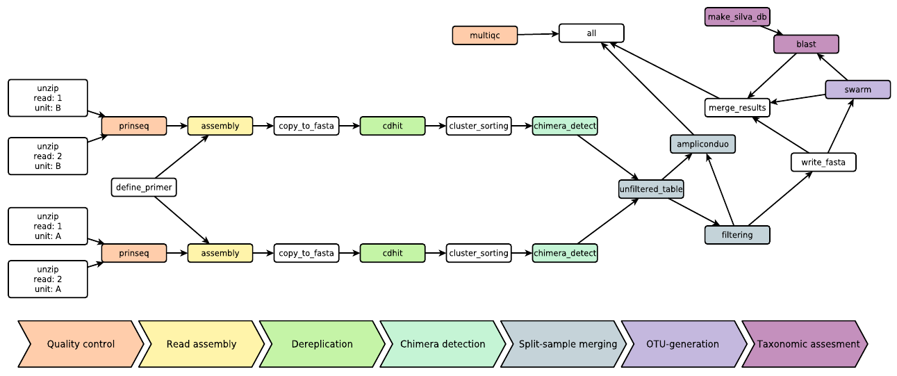
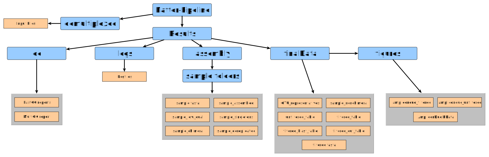
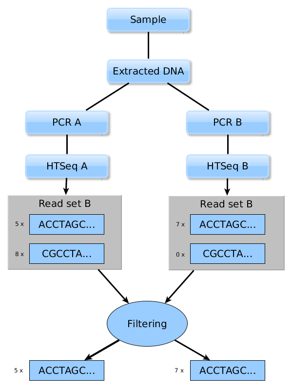
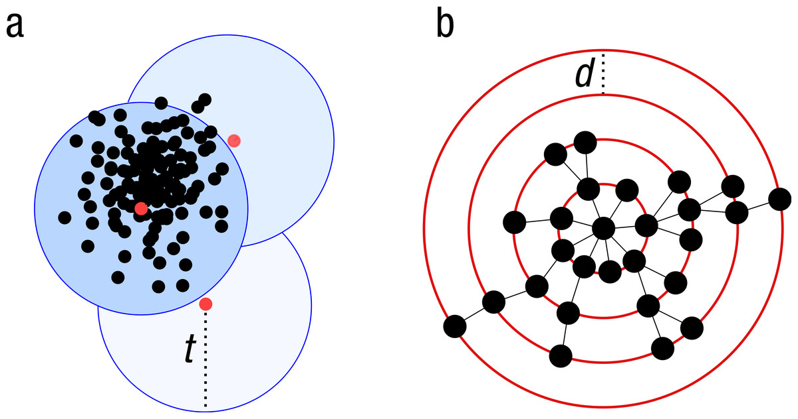

# Natrix

Natrix is an open-source bioinformatics workflow for the preprocessing of raw sequencing data.
The need for a scalable, reproducible workflow for the processing of environmental amplicon data led to the development of Natrix. It is divided into quality assessment, read assembly, dereplication, chimera detection, split-sample merging, OTU-generation and taxonomic assessment. The pipeline is written in [Snakemake](https://snakemake.readthedocs.io) (Köster and Rahmann 2018), a workflow management engine for the development of data analysis workflows. Snakemake ensures reproducibility of a workflow by automatically deploying dependencies of workflow steps (rules) and scales seamlessly to different computing environments like servers, computer clusters or cloud services. While Natrix was only tested with 16S and 18S amplicon data, it should also work for other kinds of sequencing data. The pipeline contains seperate rules for each step of the pipeline and each rule that has additional dependencies has a seperate [conda](https://conda.io/) environment that will be automatically created when starting the pipeline for the first time. The encapsulation of rules and their dependencies allows for hassle-free sharing of rules between workflows.


*DAG of an example workflow: each node represents a rule instance to be executed. The direction of each edge represents the order in which the rules are executed. Disjoint paths in the DAG can be executed in parallel. Below is a schematic representation of the main steps of the pipeline, the color coding represents which rules belong to which main step.*


*So far, Natrix was only tested on Ubuntu 17.10, 18.04 and Arch Linux, feedback if it runs on other operating systems and distributions would be greatly appreciated.*

---

## Dependencies
* [Conda](https://conda.io/en/latest/index.html)
* [GNU screen](https://www.gnu.org/software/screen/) (optional)

Conda can be downloaded as part of the [Anaconda](https://www.anaconda.com/) or the [Miniconda](https://conda.io/en/latest/miniconda.html) plattforms (Python 3.7).
GNU screen can be found in the repositories of most Linux distributions:

* Debian / Ubuntu based: apt-get install screen
* RHEL based: yum install screen
* Arch based: pacman -S screen

All other dependencies will be automatically installed using conda environments and can be found in the corresponding environment.yaml files in the *envs* folder and the `snakemake.yaml` file in the root directory of the pipeline.

---

## Getting Started

To install Natrix, you'll need the open-source package management system [conda](https://conda.io/en/latest/index.html) and, if you want to try Natrix using the accompanying `pipeline.sh` script you'll need [GNU screen](https://www.gnu.org/software/screen/).
After cloning this repository to a folder of your choice, it is recommended to create a general snakemake conda environment with the accompanying `snakemake.yaml`. In the main folder of the cloned repository, execute the following command:

```shell
$ conda env create -f snakemake.yaml
```
This will create a conda environment containing all dependencies for Snakemake itself. 

With Natrix comes an example [primertable](#Example-primertable) *example_data.csv*, [configfile](#Configfile) *example_data.yaml* and an example amplicon dataset in the folder *example_data*.

To try out Natrix using the example data, type in the following command:

```shell
$ ./pipeline.sh
Please enter the name of the project
$ example_data
```
The pipeline will then start a screen session using the project name (here, *example_data*) as session name and will beginn downloading dependencies for the rules. To detach from the screen session, press **Ctrl+a, d** (*first press Ctrl+a and then d*). To reattach to a running screen session, type in:

```shell
$ screen -r
```

When the workflow has finished, you can press **Ctrl+a, k** (*first press Ctrl+a and then k*). This will end the screen session and any processes that are still running.

---

## Tutorial

### Prerequisites: dataset, primertable and configuration file
The FASTQ files need to follow a specific naming convention:
```
samplename_unit_direction.fastq.gz
```
with:
* *samplename* as the name of the sample, without special characters.
* *unit*, identifier for [split-samples](#AmpliconDuo-/-Split-sample-approach) (*A*, *B*). If the split-sample approach is not used, the unit identifier is simply *A*.
* *direction*, identifier for forward (*R1*) and reverse (*R2*) reads of the same sample. If the reads are single-end, the direction identifier is *R1*.

A dataset should look like this (two samples, paired-end, no split-sample approach):
```
S2016RU_A_R1.fastq.gz
S2016RU_A_R2.fastq.gz
S2016BY_A_R1.fastq.gz
S2016BY_A_R2.fastq.gz
```
Besides the FASTQ data from the sequencing process Natrix needs a [primertable](#Example-primertable) containing the sample names and, if they exists in the data, the length of the poly-N tails, the sequence of the primers and the barcodes used for each sample and direction. Besides the sample names all other information can be omitted if the data was already preprocessed or did not contain the corresponding subsequence. Natrix also needs a [configuration](#Configfile) file in YAML format, specifying parameter values for tools used in the pipeline.

The primertable, configfile and the folder containing the FASTQ files all have to be in the root directory of the pipeline and have the same name (with their corresponding file extensions, so *project*.yaml, *project*.csv and the *project* folder containing the FASTQ files). The first [configfile](#Configfile) entry (`filename`) also needs to be the name of the project.

### Running Natrix with the `pipeline.sh` script

IF everything is configured correctly, you can start the pipeline by typing in the following commands into your terminal emulator:

```shell
$ ./pipeline.sh
Please enter the name of the project
$ example_data
```

The pipeline will then start a screen session using the project name as session name and will beginn downloading dependencies for the rules. To detach from the screen session, press **Ctrl+a, d** (*first press Ctrl+a and then d*). To reattach to a running screen session, type in:

```shell
$ screen -r
```

When the workflow has finished, you can press **Ctrl+a, k** (*first press Ctrl+a and then k*). This will end the screen session and any processes that are still running.

### Running Natrix manually

If you prefer to run the preperation scripts and snakemake manually, you have to start by activating the snakemake environment:

```shell
$ conda activate snakemake
```

Followed by starting the demultiplexing script:

```shell
$ python3 demultiplexing.py *project*
```

with *project* being the name of your project. The demultiplexing script will, depending on the options choosen in the configuration file, demultiplex your data, sort your reads or at the very least move the data files to the locations they need to be in for the pipeline.

The second preperation script will create the `units.tsv` file, containing the file information in a way that Natrix can use it:

```shell
$ python3 create_dataframe.py *project*.yaml
```

To start the main pipeline, type in:
```shell
snakemake --use-conda --configfile *project*.yaml --cores *cores*
```
with *project* being the name of your project and *cores* being the amount of cores you want to allocate for Natrix to use.

Should the pipeline prematurely terminate (either because of an error or by deliberatly stopping it) running the command above again will start the pipeline from the point it was terminated.

---

## Output

After the workflow is finished, the original data can be found under *Natrix/demultiplexed/*, while files created during the workflow can be found under *Natrix/results/*.
<p align="center"> 

</p>

*Output file hierachy, green nodes represent folders, purple nodes represent files.*

|Folder                               |File(s)                   |Description                                                                                              |
|-------------------------------------|--------------------------|---------------------------------------------------------------------------------------------------------|
|qc                                   |FastQC reports            |Quality reports of the FastQC application.                                                               |
|                                     |MultiQC report            |Aggregated FastQC reports in a single file.                                                              |
|logs                                 |Logfiles                  |Logfiles of the different rules.                                                                         |
|assembly (one folder for each sample)|sample_low_qual.fastq     |Sequences of sample that did not pass the prinseq quality filtering.                                     |
|                                     |sample_assembled.fastq    |With PANDAseq assembled sequences.                                                                       |
|                                     |sample_singletons.fastq   |Sequences that could not be assembled.                                                                   |
|                                     |sample.fasta              |FASTA file of the assembled sequences.                                                                   |
|                                     |sample.dereplicated.fasta |Dereplicated sequences of sample                                                                         |
|                                     |sample_chimera.fasta      |Sequences of sample that are thought to be of chimeric origin.                                           |
|finalData                            |sample.nonchimera.fasta   |Sequences of sample that passed the chimera detection rule.                                              |
|                                     |unfiltered_table.csv      |Table containing the sequences of all samples and their abundances per sample.                           |
|                                     |filtered_table.csv        |Table containing the sequences of all samples and their abundances per sample after filtering.           |
|                                     |filtered_out_table.csv    |Table containing the sequences that did not pass the filtering rule.                                     |
|                                     |filtered.fasta            |The sequences of the filtered_table.csv in FASTA format.                                                 |
|                                     |filtered_blast_table.csv  |Table containing the sequences of the filtered_table.csv and the taxonomic information assigned to each. |
|figures                              |ampliconduo_unfiltered.png|Discordance graph before the filtering.                                                                  |
|                                     |ampliconduo_filtered.png  |Discordance graph after filtering.                                                                       |
|                                     |AmpliconDuo.Rdata         |RData file containing the results of the AmpliconDuo statistical analysis.                               |

---

# Steps of the Pipeline
## Initial demultiplexing
The sorting of reads accoring to their barcode is known as demultiplexing. In Natrix, the demultiplexing step is implemented in a separate script, independent from the rest
of the pipeline, as it is often already done by the sequencing company and therefore in most cases not necessary.

## Quality control
For quality control the pipeline uses the programs FastQC (Andrews 2010), MultiQC (Ewels
et al. 2016) and PRINSEQ (Schmieder and Edwards 2011).

### FastQC 
FastQC generates a quality report for each FASTQ file, containing information such
as the per base and average sequence quality (using the Phred quality score), overrepresented
sequences, GC content, adapter and the k-mer content of the FASTQ file.

### MultiQC 
MultiQC aggregates the FastQC reports for a given set of FASTQ files into a
single report, allowing reviews of all FASTQ files at once. PRINSEQ is used to filter out sequences with an average quality score below
the threshold that can be defined in the configuration file of the pipeline.

## Read assembly
### Define primer
The define_primer rule specifies the subsequences to be removed by the
assembly rule, specified by entries of the configuration file and a primer table that contains information about the primer and barcode sequences used and the length of the poly-N subsequences. Besides removing the subsequences based on their nucleotide sequence, it is also possible to remove them based solely on their length using an offset. Using an offset can be useful if the sequence has many uncalled bases in the primer region, which could otherwise hinder matches between the target sequence defined in the primer table and the sequence read.

### Assembly 
To assemble paired-end reads and remove the subsequences described in the pre-
vious section PANDAseq (Masella et al. 2012) is used, which uses a probabilistic error correction to assemble overlapping forward- and reverse-reads. After assembly and sequence trimming, it will remove sequences that do not meet a minimal or maximal length threshold, have an assembly quality score below a threshold that can be defined in the configuration file and sequences whose forward- and reverse-read do not have an sufficiently long overlap. The thresholds for each of these procedures can be adjusted in the configuration file. If the reads are single-end, the subsequences (poly-N, barcode and the primer) that are defined in the define_primer rule are removed, followed by the removal of sequences that do not meet a minimal or maximal length threshold as defined in the configuration file.

## Similarity clustering
### Conversion of FASTQ files to FASTA files 
The rule copy_to_fasta converts the FASTQ files to FASTA files to reduce the disc space occupied by the files and to allow the usage of CD-HIT, which requires FASTA formated sequencing files. Clustering of similar sequences The CD-HIT-EST algorithm (Fu et al. 2012) clusters sequences together if they are either identical or if a sequence is a subsequence of another. This clustering approach is known as dereplication. Beginning with the longest sequence of the dataset as the first representative sequence, it iterates through the dataset in order of
decreasing sequence length, comparing at each iteration the current query sequence to all representative sequences. If the sequence identity threshold defined in the configuration file is met for a representative sequence, the counter of the representative sequence is increased by one. If the threshold could not be met for any of the existing representative sequences, the query sequence is added to the pool of representative sequences. Cluster sorting The cluster_sorting rule uses the output of the cdhit rule to count the amount of sequences represented by each cluster, followed by sorting the representative sequences in descending order according to the cluster size and adds a specific header to each
sequence as required by the UCHIME chimera detection algorithm.

## Chimera detection
### VSEARCH
VSEARCH is a open-source alternative to the USEARCH toolkit, which aims to functionally replicate the algorithms used by USEARCH for which the source code is not openly available and which are often only rudimentarily described (Rognes et al. 2016). Natrix uses as an alternative to UCHIME the VSEARCH uchime3_denovo algorithm to detect chimeric sequences (further referred to as VSEARCH3). The VSEARCH3 algorithm is a replication of the UCHIME2 algorithm with optimized standard parameters. The UCHIME2 algorithm is described by R. Edgar 2016 as follows:

"Given a query sequence *Q*, UCHIME2 uses the UCHIME algorithm to construct a model
(*M*), then makes a multiple alignment of *Q* with the model and top hit (*T*, the most similar reference sequence). The following metrics are calculated from the alignment: number of differences d<sub>QT</sub> between Q and T and d<sub>QM</sub> between *Q* and *M*, the alignment score (*H*) using eq. 2 in R. C. Edgar et al. 2011. The fractional divergence with respect to the top hit is calculated as div<sub>T</sub> = (d<sub>QT</sub> − d<sub>QM</sub>)/|Q|. If divT is large, the model is a much better match than the top hit and the query is more likely to be chimeric, and conversely if div<sub>T</sub> is small, the model is more likely to be a fake." 

The difference between the UCHIME2 and UCHIME3 algorithm is that to be selected as a potential parent, a sequence needs to have at least 16 times the abundance of the query sequence in the UCHIME3 algorithm, while it only needs double the abundance of the query sequence to be selected as a potential parent in the UCHIME2 algorithm.

## Table creation and filtering
### Merging of all FASTA files into a single table
For further processing the rule unfiltered_table merges all FASTA files into a single, nested dictionary, containing each sequence as the key with another dictionary as value, whose keys are all (split -) samples in which the sequence occurred in and as values the abundance of the sequence in the particular (split - ) sample. For further pipeline processing the dictionary is temporarily saved in JSON format. To ease statistical analysis of the data the dictionary is also exported as a comma separated table. Filtering In the filtering rule of the pipeline all sequences that do not occur in both splitsamples of at least one sample are filtered out. For single-sample data, the filtering rule uses an abundance cutoff value that can be specified in the configuration file to filter out all sequences which have abundances less
or equal the specified cutoff value. The filtered data and the filtered out data is subsequently exported as comma separated tables.

### Table conversion to FASTA files
As the swarm rule needs FASTA files as input, the resulting table of the filtering is converted to a FASTA file by the rule write_fasta.

## AmpliconDuo / Split-sample approach
The pipeline supports both single-sample and split-sample FASTQ amplicon data. The split-sample protocol (Lange et al. 2015) aims to reduce the amount of sequences that are the result of PCR or sequencing errors without the usage of stringent abundance cutoffs, which often lead to the loss of rare but naturally occurring sequences. To achieve this, extracted DNA from a single sample is divided into two split-samples, which are then separately amplified and sequenced. All sequences that do not occur in both split-samples are seen as erroneous sequences and filtered out. The method is therefore based on the idea that a sequence that was created by PCR or sequencing errors does not occur in both samples. A schematic representation of the split-sample method is shown below:

<p align="center"> 

</p>

*Schematic representation of the split-sample approach: Extracted DNA from a single environmental sample is splitted and separately amplified and sequenced. The filtering rule compares the resulting read sets between two split-samples, filtering out all sequences that do not occur in both split-samples. Image adapted from Lange et al. 2015.*

The initial proposal for the split-sample approach by Dr. Lange was accompanied by the release of the R package [AmpliconDuo](https://cran.r-project.org/web/packages/AmpliconDuo/index.html) for the statistical analysis of amplicon data produced by the aforementioned split-sample approach. It uses Fishers exact test to detect significantly deviating read numbers between two experimental branches A and B from the sample S. To measure the discordance between two branches of a sample the read-weighted discordance ∆<sup>r</sup><sub>Sθ</sub> , which is weigthed by the average read number of sequence i in both branches and the unweighted discordance ∆<sup>u</sup><sub>Sθ</sub> for each sequence i are calculated.
If ∆<sup>u</sup><sub>Sθ</sub> = 0 each branch of sample S contains the same set of sequences, while if ∆<sup>r</sup><sub>Sθ</sub> = 0
the read numbers for each sequence in sample S are within the error margin set by the chosen false discovery rate. The results of the discordance calculations are then plotted for visualization purposes and written to an R data file to allow the filtering of significantly deviating sequences.

## OTU generation
OTUs are generated using the Swarm clustering algorithm (Mahé et al. 2015) in the identically named rule. Swarm clusters sequences into OTUs using an iterative approach with a local threshold: It creates a pool of amplicons from the input file and a empty OTU. Subsequently, it will remove the first amplicon from the pool, which will become the OTU seed. All amplicons left in the pool that differ in their nucleotide composition from the initial seed by a user given threshold (the default threshold used is 1 nucleotide) are removed from the pool and added to the OTU as subseeds. In the next iteration, each amplicon having at most a difference as high as the threshold to any of the subseeds is then removed from the
pool and added to the OTU. This iterative process will continue until there are no amplicons left in the pool with a nucleotide difference of at most the threshold to any of the subseeds added in the previous iteration to the OTU, leading to the closure of the OTU and the opening of a new one. This approach to OTU generation circumvents two sources of OTU variability that are inherent to greedy clustering algorithms: the input order dependency, in which the first amplicon in a FASTA file will become the centroid of an OTU and the use of a global threshold, recruiting all amplicons that have less differences to the centroid than a user defined threshold. The iterative approach of Swarm produces a star-shaped minimum
spanning tree, with an (usually highly abundant) amplicon as the center, regardless of the chosen first amplicon of the OTU, as visualized in Figure 12. The sequence of the amplicon at the center of each OTU tree is used in subsequent analysis steps as the representative sequence of the corresponding OTU.
<p align="center"> 

</p>

*Schematic representation of the greedy clustering approach and the iterative Swarm approach. The greedy approach (a) that uses a global clustering threshold t and input order dependent centroid selection can lead to the placement of closely related amplicons into different OTUs. The iterative approach of Swarm (b), with a local threshold d, leads to
OTUs containing only closely related amplicons with a natually forming centroid during the iterative growth process of the OTU. Image from Mahé et al. 2015.*

## Sequence comparison
The assignment of taxonomic information to an OTU is an important part of the processing of environmental amplicon data, as the characteristics of known groups or species can be used to assess the environmental conditions of the samples origin. To find sequences that are similar to the representative sequence of each OTU the BLAST (basic local alignment search
tool) algorithm (Altschul et al. 1990) is used to search for similar sequences in the SILVA database (Pruesse et al. 2007). The SILVA database contains aligned rRNA sequencing data that are curated in a multi-step process. While it has an extensive collection of highquality prokaryotic rRNA sequencing data, it only contains a limited amount of microbial
eukaryotic sequencing data. If the database is not locally available, the required files will automatically be downloaded and the database will be build in the rule make_silva_db. The BLAST algorithm itself will be executed in the blast rule. As the aim is to find similar nucleotide sequences in the database for each query sequence the nucleotide-nucleotide BLAST (BLASTn) variation of the BLAST algorithm is used. The tab separated output file of the blast rule contains the following information for each representative sequence if the output of the BLASTn search meets the criteria defined in the [configuration](#Configfile) file:

| Column Nr. | Column Name | Description                                   |
|------------|-------------|-----------------------------------------------|
| 1.         | qseqid      | Query sequence identification                 |
| 2.         | qlen        | Length of the query sequence                  |
| 3.         | length      | Length of the alignment                       |
| 4.         | pident      | Percentage of identical matches               |
| 5.         | mismatch    | Number of mismatches                          |
| 6.         | qstart      | Start of the alignment in the query sequence  |
| 7.         | qend        | End of the alignment in the query sequence    |
| 8.         | sstart      | Start of the alignment in the target sequence |
| 9.         | send        | End of the alignment in the target sequence   |
| 10.        | gaps        | Number of gaps                                |
| 11.        | evalue      | E-value                                       |
| 12.        | stitle      | Title (taxonomy) of the target sequence       |

## Merging of the results
The output data from the write_fasta, swarm and blast rules are merged to a single comma
separated table in the merge_results rule, containing for each representative sequence the
sequence identification number, the nucleotide sequence, the abundance of the sequence in
each sample, the sum of abundances and, if the blast rule found a similar sequence, all information found in the table shown in the previous section.

# Example primertable
The primertable should be a .csv file (*project*.csv) in the following format:

| Probe     | poly_N | Barcode_forward | specific_forward_primer | poly_N_rev | Barcode_reverse | specific_reverse_primer |
|-----------|--------|-----------------|-------------------------|------------|-----------------|-------------------------|
| S2016BY_A | NNNNN  |                 | GTACACACCGCCCGTC        | N          |                 | GCTGCGYYCTTCATCGDTR     |
| S2016RU_A | NNNN   |                 | GTACACACCGCCCGTC        | NN         |                 | GCTGCGYYCTTCATCGDTR     |

# Configfile
Below are the explainations for the configfile (*project*.yaml) entries:

|FIELD1           |default                                                                          |description                                                                                                                                                                                                                                  |
|-----------------|---------------------------------------------------------------------------------|---------------------------------------------------------------------------------------------------------------------------------------------------------------------------------------------------------------------------------------------|
|filename         |project                                                                          |The filename of the project folder, primertable (.csv) and config file (.yaml).                                                                                                                                                              |
|primertable      |project.csv                                                                      |Path to the primertable.                                                                                                                                                                                                                     |
|units            |units.tsv                                                                        |Path to the sequencing unit sheet.                                                                                                                                                                                                           |
|cores            |4                                                                                |Amount of cores available for the workflow.                                                                                                                                                                                                  |
|multiqc          |False                                                                            |Initial quality check (fastqc & multiqc), currently only works for not yet assembled reads.                                                                                                                                                  |
|demultiplexing   |False                                                                            |Demultiplexing for reads that were not demultiplexed by the sequencing company (slow).                                                                                                                                                       |
|read_sorting     |False                                                                            |Read sorting for paired end reads that were not sorted by the sequencing company (slow).                                                                                                                                                     |
|already_assembled|False                                                                            |Skipping of the quality control and read assembly steps for data that is already assembled.                                                                                                                                                  |
|threshold        |0.9                                                                              |PANDAseq score threshold a sequence must meet to be kept in the output.                                                                                                                                                                      |
|minoverlap       |15                                                                               |Sets the minimum overlap between forward and reverse reads.                                                                                                                                                                                  |
|minqual          |1                                                                                |Minimal quality score for bases in an assembled read to be accepted by PANDAseq.                                                                                                                                                             |
|minlen           |100                                                                              |The minimal length of a sequence after primer removal to be accepted by PANDAseq.                                                                                                                                                            |
|maxlen           |600                                                                              |The maximal length of a sequence after primer removal to be accepted by PANDAseq.                                                                                                                                                            |
|primer_offset    |False                                                                            |Using PANDAseq to remove primer sequences by length offset instead of sequence identity.                                                                                                                                                     |
|mq               |25                                                                               |Minimum quality sequence check (prinseq), filtering of sequences according to the PHRED quality score before the assembly.                                                                                                                   |
|barcode_removed  |True                                                                             |Boolean that indicates if the sequence is free of barcodes.                                                                                                                                                                                  |
|all_primer       |True                                                                             |Boolean that indicates if the sequence is free of any kind of additional subsequences (primer, barcodes etc.).                                                                                                                               |
|clustering       |1.0                                                                              |Percent identity for cdhit (dereplication) (1 = 100%), if cdhit is solely to be used for dereplication (recommended), keep the default value.                                                                                                |
|length_overlap   |0.0                                                                              |Length difference cutoff, default 0.0 if set to 0.9, the shorter sequences need to be at least 90% length of the representative of the cluster.                                                                                              |
|representative   |longest                                                                          |Which sequence to use as a representative sequence per CDHIT cluster. longest = the longest sequence of the corresponding cluster, most_common = the most common sequence of the corresponding cluster.                                      |
|beta             |8.0                                                                              |Weight of a "no" vote for the VSEARCH chimera detection algorithm.                                                                                                                                                                           |
|pseudo_count     |1.2                                                                              |Pseudo - count prior on number of “no” votes.                                                                                                                                                                                                |
|abskew           |16                                                                               |Minimum abundance skew, definied by (min(abund.(paren1), abund.(paren2))) / abund.(child).                                                                                                                                                   |
|filter_method    |not_split                                                                        |If the split sample approach was used (split_sample) or not (not_split).                                                                                                                   |
|cutoff           |3                                                                                |An additional abundance filter if the split sample approach was not used.                                                                                                                                                                    |
|ampli_corr       |fdr                                                                              |Specifies the correction method for Fisher's exact test.                                                                                                                                                                                     |
|save_format      |png                                                                              |File format for the frequency-frequency plot.                                                                                                                                                                                                |
|plot_AmpDuo      |True                                                                             |If the frequency-frequency plot should be saved.                                                                                                                                                                                             |
|paired_End       |True                                                                             |The format of the sequencing data, TRUE if the reads are in paired-end format.                                                                                                                                                               |
|name_ext         |R1                                                                               |The identifier for the forward read (for the reverse read the 1 is switched with 2, if the data is in paired-end format), has to be included at the end of the file name, before the file format identifier (including for single end files).|
|swarm            |True                                                                             |Boolean to indicate the use of the SWARM clustering algorithm to create operational taxonomic units (OTUs) from the data.                                                                                                                    |
|blast            |False                                                                            |Boolean to indicate the use of the BLAST clustering algorithm to assign taxonomic information to the OTUs.                                                                                                                                   |
|database          |SILVA                                                                |Database against which the BLAST should be carried out, at the moment "NCBI" and "SILVA" are supported.                          |
|db_path          |database/silva/silva.db                                                                |Path to the database file against which the BLAST should be carried out, at the moment only the SILVA and NCBI databases will be automatically downloaded, other databases have to be downloaded and configurated manually.                           |
|max_target_seqs  |1                                                                                |Number of blast hits that are saved per sequence / OTU.                                                                                                                                                                                      |
|ident            |90.0                                                                             |Minimal identity overlap between target and query sequence.                                                                                                                                                                                  |
|evalue           |1e-51                                                                            |Highest accepted evalue.                                                                                                                                                                                                                     |
|out6             |"6 qseqid qlen length pident mismatch qstart qend sstart send gaps evalue stitle"|Additional BLAST information to be saved.                                                                                                                                                                                                    |


---
# References

* Köster, Johannes and Sven Rahmann (2018). “Snakemake—a scalable bioinformatics workflow engine”. In: *Bioinformatics.*
* Andrews, S. (2010). FASTQC. A quality control tool for high throughput sequence data.
* Ewels, P et al. (2016). “MultiQC: summarize analysis results for multiple tools and samples in a single report”. In: *Bioinformatics* 32.19, pp. 3047–3048.
* Schmieder, Robert and Robert A. Edwards (2011). “Quality control and preprocessing of metagenomic datasets.” In: *Bioinformatics* 27.6, pp. 863–864.
* Masella, Andre P et al. (2012). “PANDAseq: paired-end assembler for illumina sequences”. In: *BMC Bioinformatics 13.1*, p. 31.
* Fu, Limin et al. (2012). “CD-HIT: accelerated for clustering the next-generation sequencing
data”. In: *Bioinformatics 28.23*, pp. 3150–3152.
*  Rognes, Torbjørn et al. (2016). “VSEARCH: a versatile open source tool for metagenomics”.
In: *doi: 10.7287/peerj.preprints.2409v1.*
* Edgar, Robert (2016). “UCHIME2: improved chimera prediction for amplicon sequencing”. In: *bioRxiv.*
* Mahé, Frédéric et al. (2015). “Swarm v2: highly-scalable and high-resolution amplicon clustering”. In: *PeerJ 3.*
* Lange, Anja et al. (2015). “AmpliconDuo: A Split-Sample Filtering Protocol for High-Throughput Amplicon Sequencing of Microbial Communities”. In: *Plos One 10.11.*
* Altschul, Stephen F. et al. (1990). “Basic local alignment search tool”. In: *Journal of Molecular Biology 215.3*, pp. 403–410.
* Pruesse, E. et al. (2007). “SILVA: a comprehensive online resource for quality checked and aligned ribosomal RNA sequence data compatible with ARB”. In: *Nucleic Acids Research 35.21*, pp. 7188–7196.


